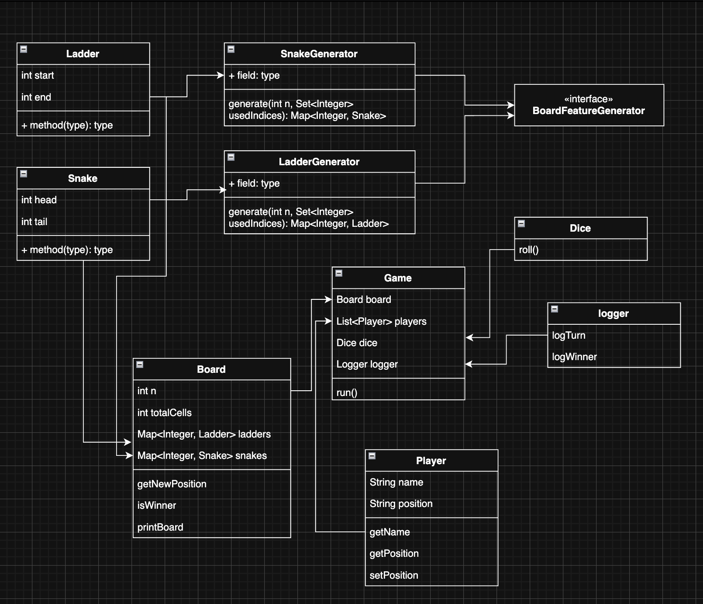

# Snake and Ladders

A command-line implementation of the classic **Snake and Ladders** board game built in Java. Supports configurable board sizes, multiple players, and randomly generated snakes & ladders.

---

## UML DIAGRAM



---

## How to Run

### Compile

```bash
javac *.java
```

### Run

```bash
java Main
```

### Example Session

```
Enter board size: 5
Enter number of Players: 2
Enter name of the 1th player: Alice
Enter name of the 2th player: Bob

--- Board Layout ---
Size    : 5 x 5 (25 cells)
Snakes  : 18->3, 22->11
Ladders : 5->19, 9->21
--------------------

=== Game Start ===
Alice (pos 0) rolled 4
 Moves from 0 to 4
Bob (pos 0) rolled 5
 Ladder! Climbs from 5 up to 19
Alice (pos 4) rolled 6
 OVERSHOT stays at 4
...
Alice wins! (#1)
==== Final Result ====
#1 Alice
#2 Bob
```

---

## Game Rules

1. All players start at position **0** (off the board).
2. Players take turns rolling a single six-sided die.
3. A player moves forward by the number rolled.
4. **Snake** — landing on a snake's head sends the player down to its tail.
5. **Ladder** — landing on a ladder's start sends the player up to its end.
6. **Overshot** — if a roll would move a player past the last cell, they stay in place.
7. The first player to land **exactly** on the last cell (`n × n`) wins.
8. The game continues until only one player remains; all players are ranked.

---

## Project Structure

```
SnakeAndLadders/
├── Main.java                  # Entry point — reads input and starts the game
├── Game.java                  # Game loop — manages turns, win detection, leaderboard
├── Board.java                 # Board state — snakes, ladders, move resolution
├── Player.java                # Player model — name and current position
├── Dice.java                  # Single six-sided die
├── Snake.java                 # Snake entity (head → tail)
├── Ladder.java                # Ladder entity (start → end)
├── SnakeGenerator.java        # Randomly generates snakes on the board
├── LadderGenerator.java       # Randomly generates ladders on the board
├── BoardFeatureGenerator.java # Generic interface for board feature generators
├── MoveResult.java            # Encapsulates the result of a single move
├── MoveType.java              # Enum: NORMAL, SNAKE, LADDER, OVERSHOT
└── Logger.java                # Formats and prints game events
```
